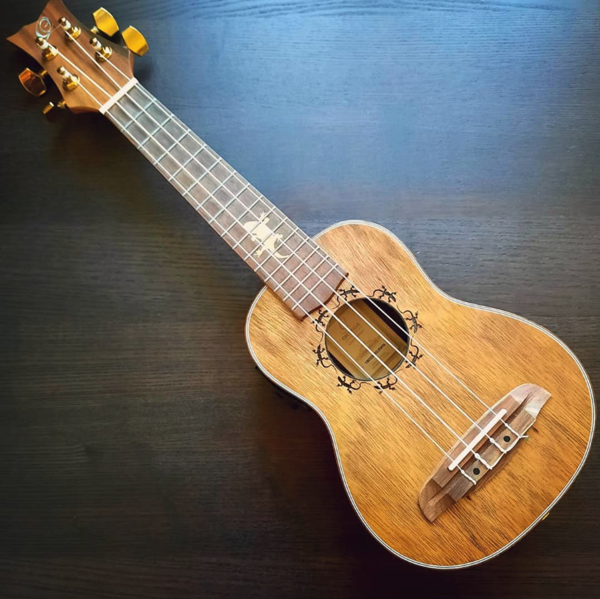

# Ukulele samples
Ukulele samples - tuned to C with various attack styles, releases, vibrato, slides and harmonics 

Inspired by https://github.com/cleary/samples-flbass

These samples were developed with the intent to use in [TidalCycles](https://github.com/tidalcycles/Tidal). All samples are normalized to -1.0 dBFS.

## Additional infos

- DAW: Ableton-Live 10, recorded dry
- Audio Interface: PreSonus AudioBox USB 96
- Instrument: Ortega Lizard Ukulele (affectionately called Sally)

